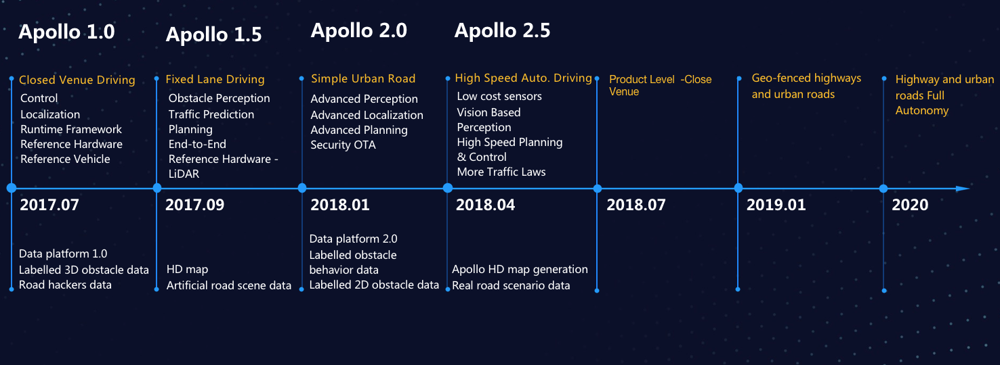
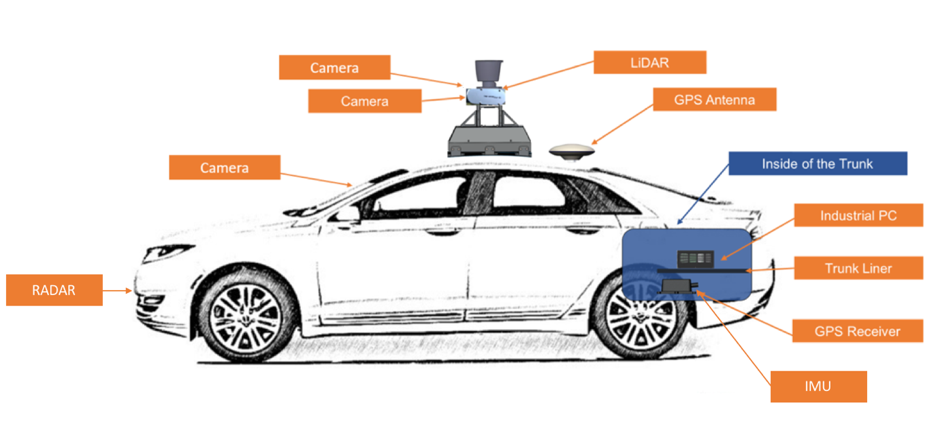
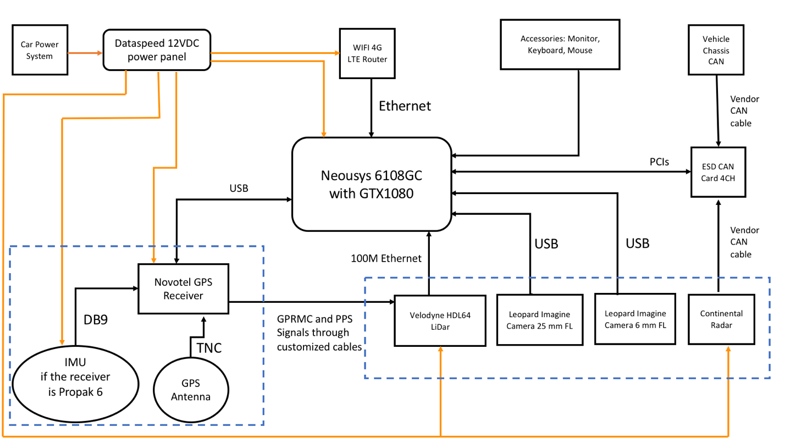
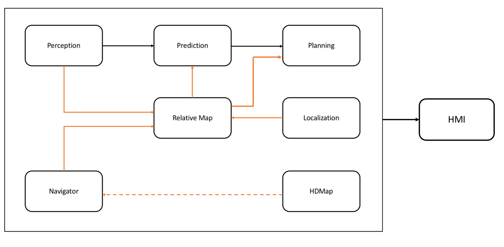

[](https://travis-ci.org/ApolloAuto/apollo) [](https://azure.apollo.auto/dailybuild)

```

We choose to go to the moon in this decade and do the other things,

not because they are easy, but because they are hard.

-- John F. Kennedy, 1962

```

Welcome to Apollo's GitHub page!

[Apollo](http://apollo.auto) is a high performance, flexible architecture which accelerates the development, testing, and deployment of Autonomous Vehicles.

For business and partnership, please visit [our website](http://apollo.auto).

## Getting Started

**The Apollo Team now proudly presents to you the latest [version 2.5](https://github.com/ApolloAuto/apollo/releases/tag/v2.5.0).**


 Apollo 2.5 is loaded with new modules and features, but needs to be callibrated and configured perfectly before you take it for a spin. Please review the prerequisites and installation steps in detail to ensure that you are well equipped to build and launch Apollo. You could also check out Apollo's architecture overview for a greater understanding on Apollo's core technology and platform. 

[Want to contribute to our code?](https://github.com/ApolloAuto/apollo/blob/master/CONTRIBUTING.md) follow this guide.

## Prerequisites

#### Basic Requirements:

* Vehicle equipped with by-wire system, including but not limited to brake by-wire, steering by-wire, throttle by-wire and shift by-wire (Apollo is currently tested on Lincoln MKZ)

* A machine with a 4-core processor and 6GB memory minimum

* Ubuntu 14.04

* Working knowledge of Docker

~~~ 
 - Please note, it is recommended that you install the versions of Apollo in the following order: 
 1.0 > 1.5 > 2.0 > 2.5
 The reason behind this recommendation is that you need to confirm whether individual hardware components 
 and modules are functioning correctly and clear various version test cases,
 before progressing to a higher more capable version for your safety and the safety of those around you.

 - Please note, if you do not have a vehicle, proceed to the Installation - without hardware 
~~~

#### Individual Version Requirements:

The following diagram highlights the scope and features of each Apollo release:



[**Apollo 1.0:**](https://github.com/ApolloAuto/apollo/blob/master/docs/quickstart/apollo_1_0_hardware_system_installation_guide.md) 

Apollo 1.0 also referred to as the Automatic GPS Waypoint Following, works in an enclosed venue such as a test track or parking lot. This installation is necessary to ensure that Apollo works perfectly with your vehicle. The diagram below lists the various modules in Apollo 1.0.


**For Setup:**

* **Hardware**:

    * Industrial PC (IPC)

    * Global Positioning System (GPS)

    * Inertial Measurement Unit (IMU)

    * Controller Area Network (CAN) card

    * Hard drive

    * GPS Antenna

    * GPS Receiver

* **Software**:

    * Apollo Linux Kernel (based on Linux Kernel 4.4.32)

[**Apollo 1.5:**](https://github.com/ApolloAuto/apollo/blob/master/docs/quickstart/apollo_1_5_hardware_system_installation_guide.md) 

Apollo 1.5 is meant for fixed lane cruising. With the addition of LiDAR, vehicles with this version now have better perception of its surroundings and can better map its current position and plan its trajectory for safer maneuvering on its lane. Please note, the modules highlighted in Yellow are additions or upgrades for version 1.5.

	

**For Setup:**

* All the requirements mentioned in version 1.0

* **Hardware**:

    * Light Detection and Ranging System (LiDAR)

    * ASUS GTX1080 GPU-A8G- Gaming GPU Card

* **Software**:

    * Nvidia GPU Driver

[**Apollo 2.0:**](https://github.com/ApolloAuto/apollo/blob/master/docs/quickstart/apollo_2_0_hardware_system_installation_guide_v1.md#key-hardware-components)

Apollo 2.0 supports vehicles autonomously driving on simple urban roads. Vehicles are able to cruise on roads safely, avoid collisions with obstacles, stop at traffic lights and change lanes if needed to reach their destination.  Please note, the modules highlighted in Red are additions or upgrades for version 2.0.


**For Setup:**

* All the requirements mentioned in versions 1.5 and 1.0

* **Hardware**:

    * Traffic Light Detection using Camera

    * Ranging System (LiDAR)

    * Radar

* **Software**:

    * Same as 1.5

[**Apollo 2.5:**](https://github.com/ApolloAuto/apollo/blob/master/docs/quickstart/apollo_2_5_hardware_system_installation_guide_v1.md)

Apollo 2.5 allows the vehicle to autonomously run on geo-fenced highways with a camera for obstacle detection. Vehicles are able maintain lane control, cruise and avoid collisions with vehicles ahead of them. 

```
Please note, if you need to test Apollo 2.5; for safety purposes, please seek the help of the
Apollo Engineering team. Your safety is our #1 priority,
and we want to ensure Apollo 2.5 was integrated correctly with your vehicle before you hit the road. 
```


**For Setup:**

* All the requirements mentioned in 2.0

* Hardware:

    * Additional Camera

* Software: 

    * Same as 2.0 

## Architecture

* **Hardware/ Vehicle Overview**



* **Hardware Connection Overview**



* **Software Overview - Navigation Mode**



## Installation

### With Hardware:

* [Fork and then Clone Apollo's GitHub code](https://github.com/ApolloAuto/apollo) 

* [Build and Release using Docker](https://github.com/ApolloAuto/apollo/blob/master/docs/howto/how_to_build_and_release.md) - This step is required

* [Launch and Run Apollo](https://github.com/ApolloAuto/apollo/blob/master/docs/howto/how_to_launch_Apollo.md)

* [Apollo 1.0 QuickStart Guide](https://github.com/ApolloAuto/apollo/blob/master/docs/quickstart/apollo_1_0_quick_start.md)

* [Apollo 1.5 QuickStart Guide](https://github.com/ApolloAuto/apollo/blob/master/docs/quickstart/apollo_1_5_quick_start.md)

* [Apollo 2.0 QuickStart Guide](https://github.com/ApolloAuto/apollo/blob/master/docs/quickstart/apollo_2_0_quick_start.md)

* [Apollo 2.5 QuickStart Guide](https://github.com/ApolloAuto/apollo/blob/master/docs/quickstart/apollo_2_5_quick_start.md)

### Without Hardware:

* [How to Build Apollo ](https://github.com/ApolloAuto/apollo/tree/master/docs/demo_guide)

## Documents

* [HowTo](https://github.com/ApolloAuto/apollo/tree/master/docs/howto): Brief technical solutions to common problems that developers face during the installation and use of the Apollo platform 

* [Specs](https://github.com/ApolloAuto/apollo/tree/master/docs/specs): A Deep dive into Apollo's Hardware and Software specifications (only recommended for expert level developers that have successfully installed and launched Apollo) 

* [FAQs](https://github.com/ApolloAuto/apollo/tree/master/docs/FAQs) 

## Questions

You are welcome to submit questions and bug reports as [GitHub Issues](https://github.com/ApolloAuto/apollo/issues).

## Copyright and License

Apollo is provided under the [Apache-2.0 license](https://github.com/natashadsouza/apollo/blob/master/LICENSE).

## Disclaimer

Please refer the Disclaimer of Apollo in [Apollo's official website](http://apollo.auto/docs/disclaimer.html).

## Connect with us 
* [Have suggestions for our GitHub page?](https://github.com/ApolloAuto/apollo/issues)
* [Twitter](https://twitter.com/apolloplatform)
* [YouTube](https://www.youtube.com/channel/UC8wR_NX_NShUTSSqIaEUY9Q)
* [Blog](https://www.medium.com/apollo-auto)
* [Newsletter](http://eepurl.com/c-mLSz)


